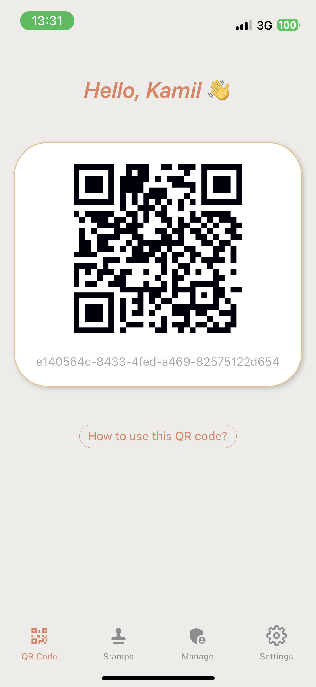
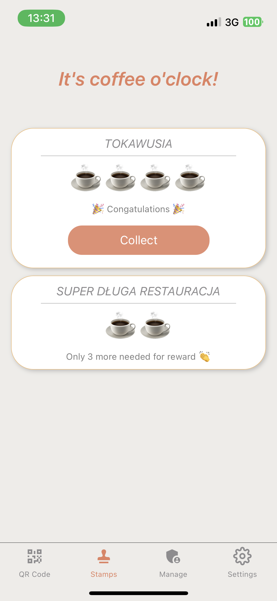

# Stamp
Stamp is a loyalty stamp-collecting app designed for café enthusiasts.

## Why?
The primary motivation for this project is to experiment with Scala stack. 

**This project is not production ready.** I use it to learn and experiment with different technologies and approaches.

## Tech Stack
- Scala 2.13
- Tapir
- Cats and Cats Effect
- Refined types
- Doobie
- Postgres
- Circe
- Pureconfig
- Chimney
- Embedded Postgres (based on [bootzooka](https://github.com/softwaremill/bootzooka))

## Usage
### Restaurant Employees and Owners
Restaurant owners and managers can configure stamp settings and establish the rewards that customers can earn. 
Additionally, they can authorize specific employees to scan visitors' QR codes for both stamp collection and reward redemption.

### Café Clients
Every time you visit your favorite café and make a purchase, you have the option to show a QR code and earn a stamp. Accumulate enough stamps and you'll unlock rewards.

## Minimal Mobile App Implementation
 

## Still to do...
- Add missing integration tests
  - Add missing db state checks after tests 
  - `ConfirmCollectionSpec`
  - `FindStampConfigSpec`
  - Db access tests
  - Consider splitting `pl.hungry.Endpoints`
  - Test `pl.hungry.Endpoints`
  - Test `pl.hungry.DatabaseAccess`
- Add docker-compose for local development
- Add instructions how to run locally
- Implement refresh token
- Implement invitation system
  - Send invitation email by admin to new user 
- Implement upgrading user to Pro (payment service)
  - Fake implementation with random failing
- Migrate to testcontainers
- Migrate to Scala 3 to check how long will it take
- Mobile App :)